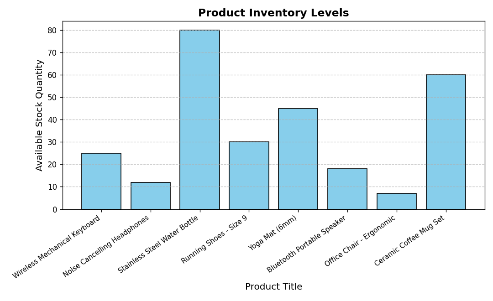
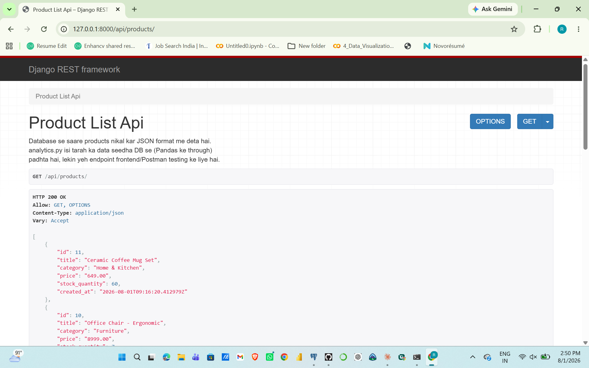

# 🛒 E-Commerce Analytics & Predictive ML Pipeline

A Data Engineering + Data Science project pairing a **Django REST Framework** backend (with **PostgreSQL**) with a standalone **analytics pipeline**: data is pulled into **Pandas**, a **Linear Regression** model is trained with a proper train/test split, and an inventory chart is generated automatically.


<sub>Chart generated by `analytics.py` from seeded sample data.</sub>

---

## 🚀 Features

- **REST API** — Django REST Framework endpoints exposing products and orders (with nested order items) as JSON
- **Relational data model** — `Product`, `Order`, and `OrderItem` with proper foreign-key relationships
- **Data pipeline** — SQLAlchemy + Pandas pull live PostgreSQL tables into clean DataFrames
- **Machine Learning** — Scikit-Learn Linear Regression trained with an 80/20 train/test split, evaluated with R² and MAE
- **Automated visualization** — Matplotlib-generated inventory chart (`product_stock_chart.png`)
- **Sample data seeding** — a custom Django management command (`seed_sample_data`) so the project runs end-to-end without needing real data
- **Environment-based config** — no secrets hardcoded; DB credentials and the Django secret key are loaded from `.env`
- **Basic test coverage** — model and API tests in `core/tests.py`

---

## 🛠️ Tech Stack

| Layer | Tools |
|---|---|
| Backend & API | Python, Django, Django REST Framework |
| Database | PostgreSQL, pgAdmin 4 |
| Data Engineering | Pandas, SQLAlchemy, Psycopg2 |
| Machine Learning & Viz | Scikit-Learn, Matplotlib, NumPy |
| Config | python-decouple (`.env`) |

---

## 📦 Project Structure

```text
NEU_Ecommerce_Project/
├── core/
│   ├── models.py                       # Product, Order, OrderItem
│   ├── serializers.py                  # DRF serializers (nested order items)
│   ├── views.py                        # API views
│   ├── urls.py                         # /api/products/, /api/orders/
│   ├── admin.py                        # Django admin registration
│   ├── tests.py                        # Model + API tests
│   └── management/commands/
│       └── seed_sample_data.py         # Populates demo data
├── ecommerce_config/                   # Django project settings
├── analytics.py                        # Data pipeline + ML training + chart
├── product_stock_chart.png             # Generated visualization
├── manage.py
├── requirements.txt
├── .env.example
└── README.md
```

---

## 📡 API Endpoints

| Method | Endpoint | Description |
|---|---|---|
| GET | `/api/products/` | List all products |
| GET | `/api/orders/` | List all orders, each with its nested order items |

**Sample response — `/api/products/`**
```json
[
  {
    "id": 1,
    "title": "Wireless Mechanical Keyboard",
    "category": "Electronics",
    "price": "3499.00",
    "stock_quantity": 25,
    "created_at": "2026-08-01T10:00:00Z"
  }
]
```



---

## ⚙️ Setup & Run Locally

**1. Clone the repo**
```bash
git clone https://github.com/rkkumar945/Ecommerce-analytics-ml-pipeline-.git
cd Ecommerce-analytics-ml-pipeline-
```

**2. Create a virtual environment**
```bash
python -m venv venv
source venv/bin/activate   # Windows: venv\Scripts\activate
```

**3. Install dependencies**
```bash
pip install -r requirements.txt
```

**4. Configure environment variables**
```bash
cp .env.example .env
# edit .env: set a fresh Django SECRET_KEY and your real PostgreSQL credentials
```

**5. Set up the database**
```bash
python manage.py migrate
```

**6. Seed sample data** (so the API and analytics script have something to show)
```bash
python manage.py seed_sample_data
```

**7. Run the server**
```bash
python manage.py runserver
```
API is now live at `http://127.0.0.1:8000/api/products/`

**8. Run the analytics pipeline**
```bash
python analytics.py
```
This prints the R² / MAE evaluation, a sample prediction, and regenerates `product_stock_chart.png`.

---

## 📈 Sample Output

```
R^2 score on test set:  0.87
MAE on test set:        1.42
Predicted demand score: 2545.30
```
(Exact numbers vary run to run since a small amount of noise is added to the synthetic demand-score label — see the comment in `analytics.py` for why.)

---

## 🚧 Roadmap / Upcoming

Planned extensions, not yet implemented:

- [ ] React.js frontend for a customer-facing storefront
- [ ] Customer segmentation with K-Means clustering
- [ ] Fraud detection with XGBoost
- [ ] Power BI dashboard fed by an automated ETL pipeline
- [ ] Authentication on API endpoints (currently open, fine for a demo project)

---

## 📄 License

Licensed under the MIT License — see [LICENSE](LICENSE) for details.
